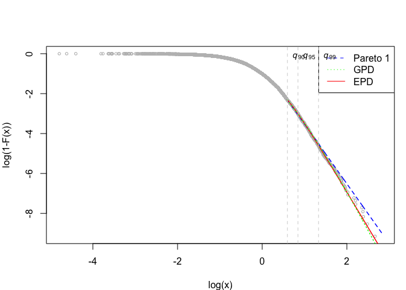
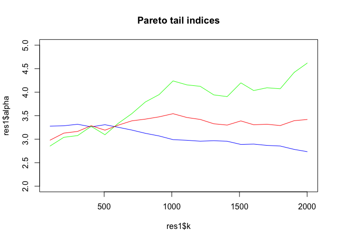
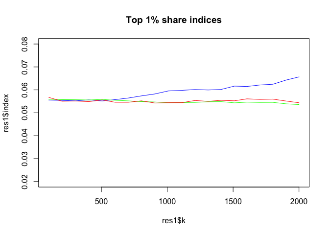

Pareto Models for Top Incomes
================
Arthur Charpentier & Emmanuel Flachaire

# Install the `TopIncomes` library

The `TopIncomes` library can be installed from *github*,

``` r
library(devtools)
devtools::install_github("freakonometrics/TopIncomes")
library(TopIncomes)
```

    ## 
    ## Attaching package: 'TopIncomes'

    ## The following objects are masked from 'package:VGAM':
    ## 
    ##     dgpd, pgpd, rgpd

# Fitting Pareto Models

``` r
n <- 1000
set.seed(123)
x <- repd(n,.5,1,-1)
w <- rgamma(n,10,10)
```

## Pareto 1

The **Pareto type 1** distribution is bounded from below by a threshold
u\>0: the cumulative distribution function is
%3D1-%5Cleft\(%5Cfrac%7Bx%7D%7Bu%7D%5Cright\)%5E%7B-%5Calpha%7D%7D)
for . The function
returns the tail index parameter
 and also
.

``` r
estim <- MLE.pareto1(data=x, weights=w, threshold=1)
estim
```

    ## $alpha
    ## [1] 3.300653
    ## 
    ## $xi
    ## [1] 0.3029704
    ## 
    ## $k
    ## [1] 1000

## Generalized Pareto

The **Generalized Pareto** distribution is bounded from below by a
threshold u\>0: the cumulative distribution function is
%3D1-%5Cleft%5B1+%5Cleft\(%5Cfrac%7Bx-u%7D%7B%5Csigma%7D%5Cright\)%5Cright%5D%5E%7B-%5Calpha%7D%7D)
for . The function
returns  and
.

``` r
estim <- MLE.gpd(data=x, weights=w, threshold=1)
estim
```

    ## $xi
    ## [1] 0.4892361
    ## 
    ## $mu
    ## [1] 1
    ## 
    ## $beta
    ## [1] 0.2488107
    ## 
    ## $k
    ## [1] 1000

## Extended Pareto

The **Extended Pareto** distribution is bounded from below by a
threshold u\>0 : the cumulative distribution function is
%3D1-%5Cleft%5B%5Cfrac%7Bx%7D%7Bu%7D%5Cleft\(1+%5Cdelta-%5Cdelta%5Cleft\(%5Cfrac%7Bx%7D%7Bu%7D%5Cright\)%5E%5Ctau%5Cright\)%5Cright%5D%5E%7B-%5Calpha%7D%20%7D)
for . The function
returns ,
 and


``` r
estim <- EPD(data=x, weights=w)
estim
```

    ## $k
    ## [1] 999
    ## 
    ## $gamma
    ## [1] 0.3737252
    ## 
    ## $kappa
    ## [1] 0.1628108
    ## 
    ## $tau
    ## [1] -3.342535

# Application to Income

Let us consider a sample of simulated data, obtained from a
Singh-Maddala distribution, and some weights:

``` r
qsinmad <- function(u,b,a,q) b*((1-u)^(-1/q)-1)^(1/a)   
rsinmad <- function(n,b,a,q) qsinmad(runif(n), b, a, q)
y=rsinmad(10000,1.14,2.07,1.75)
w=rnorm(10000,1,.2)
df <- data.frame(y,w)
Pareto_diagram(data=df$y, weights=df$w)
```

<!-- -->

## Tail index and top share estimation

The Top\_Share function can be used to estimate both the tail index
 and the top
(100p)%-share, for different thresholds to model a Pareto distribution.

``` r
Top_Share(data=df$y, weights=df$w, p=.01, q=c(.1,.05,.01), method="epd")
```

    ## $index
    ## [1] 0.05496335 0.05633313 0.05703518
    ## 
    ## $alpha
    ## [1] 3.475826 3.187573 2.882025
    ## 
    ## $tau
    ## [1] -2.993696 -3.277547 -3.169789
    ## 
    ## $kappa
    ## [1] -0.08829693  0.01641172  0.05708996
    ## 
    ## $gamma
    ## [1] 0.2877014 0.3137183 0.3469782
    ## 
    ## $share.index
    ## [1] 0.01
    ## 
    ## $share.pareto
    ## [1] 0.10 0.05 0.01
    ## 
    ## $threshold
    ## [1] 1.816260 2.328830 3.790648
    ## 
    ## $k
    ## [1] 995 498  98
    ## 
    ## $method
    ## [1] "epd"

## Tables

For a few different thresholds, we can show the results with Tables.

Let us consider a Pareto distribution fitted on the 10%, 5% and 1%
highest observations:

``` r
thresholds=c(.1,.05,.01)
res1=Top_Share(df$y,df$w,p=.01,q=thresholds, method="pareto1")
res2=Top_Share(df$y,df$w,p=.01,q=thresholds, method="gpd")
res3=Top_Share(df$y,df$w,p=.01,q=thresholds, method="epd")
```

For the tail index, we would have the following Table:

``` r
res=rbind((res1$share.pareto),res1$alpha,res2$alpha,res3$alpha)
rownames(res) <- c("q","Pareto 1", "GPD", "EPD")
print("Table of top share indices")
```

    ## [1] "Table of top share indices"

``` r
res
```

    ##              [,1]     [,2]     [,3]
    ## q        0.100000 0.050000 0.010000
    ## Pareto 1 2.991790 3.267151 3.164932
    ## GPD      4.032287 3.093852 2.710459
    ## EPD      3.475826 3.187573 2.882025

For the top 1% share, we would have the following Table:

``` r
res=rbind(res1$share.pareto,res1$index,res2$index,res3$index)
rownames(res) <- c("q","Pareto 1", "GPD", "EPD")
print("Table of top share indices")
```

    ## [1] "Table of top share indices"

``` r
res
```

    ##                [,1]       [,2]       [,3]
    ## q        0.10000000 0.05000000 0.01000000
    ## Pareto 1 0.05974219 0.05587623 0.05634723
    ## GPD      0.05516428 0.05643952 0.05680662
    ## EPD      0.05496335 0.05633313 0.05703518

## Figures

For a many different thresholds, we can show a Figure, similar to Hill
plot for the Hill estimator of the tail index (Pareto 1 case).

Let us consider a Pareto distribution fitted on the 20% to 1% highest
observations:

``` r
thresholds=seq(.2,.01,-.01)
res1=Top_Share(df$y,df$w,p=.01,q=thresholds, method="pareto1")
res2=Top_Share(df$y,df$w,p=.01,q=thresholds, method="gpd")
res3=Top_Share(df$y,df$w,p=.01,q=thresholds, method="epd")
```

For the tail index, we would have the following
Figure:

``` r
plot(res1$k,res1$alpha, col="blue", main="Pareto tail indices", ylim=c(2,5), type="l")
lines(res2$k,res2$alpha, col="green")
lines(res3$k,res3$alpha, col="red")
```

<!-- -->

For the top 1% share, we would have the following
Table:

``` r
plot(res1$k,res1$index, col="blue", main="Top 1% share indices", ylim=c(0.02,.08), type="l")
lines(res2$k,res2$index, col="green")
lines(res3$k,res3$index, col="red")
```

<!-- -->
