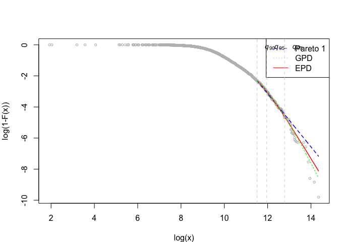

================
Arthur Charpentier & Emmanuel Flachaire

# Install the `TopIncome` library

The `TopIncome` library can be installed from *github*,

``` r
library(devtools)
devtools::install_github("freakonometrics/TopIncomes")
```

    ## Skipping install of 'TopIncomes' from a github remote, the SHA1 (a5fa2bba) has not changed since last install.
    ##   Use `force = TRUE` to force installation

``` r
library(TopIncomes)
```

# Fitting Pareto Models

``` r
n <- 1000
set.seed(123)
x <- repd(n,.5,1,-1)
w <- rgamma(n,10,10)
```

## Pareto 1

The **Pareto type 1** distribution is bounded from below by \(u>0\), and
with tail parameter  it
has the cumulative distribution function
%3D1-%5Cleft\(%5Cfrac%7Bx%7D%7Bu%7D%5Cright\)%5E%7B-%5Calpha%7D%7D)
for . Note that the
tail index is
.

``` r
estim <- MLE.pareto1(data=x, weights=w, threshold=1)
estim
```

    ## $alpha
    ## [1] 3.300653
    ## 
    ## $xi
    ## [1] 0.3029704
    ## 
    ## $k
    ## [1] 1000

## Generalized Pareto

The **Generalized Pareto** distribution is bounded from below by
\(u>0\), with tail parameter
 : the cumulative
distribution function is
%3D1-%5Cleft%5B1+%5Cleft\(%5Cfrac%7Bx-u%7D%7B%5Csigma%7D%5Cright\)%5Cright%5D%5E%7B-%5Calpha%7D%7D)
for . Note that the
tail index is
.

``` r
estim <- MLE.gpd(data=x, weights=w, threshold=1)
estim
```

    ## $xi
    ## [1] 0.4892361
    ## 
    ## $mu
    ## [1] 1
    ## 
    ## $beta
    ## [1] 0.2488107
    ## 
    ## $k
    ## [1] 1000

## Extended Pareto

The **Extended Pareto** distribution is bounded from below by \(u>0\),
and has cumulative distribution function
%3D1-%5Cleft%5B%5Cfrac%7Bx%7D%7Bu%7D%5Cleft\(1+%5Cdelta-%5Cdelta%5Cleft\(%5Cfrac%7Bx%7D%7Bu%7D%5Cright\)%5E%5Ctau%5Cright\)%5Cright%5D%5E%7B-%5Calpha%7D%20%7D)
for . Note that the
tail index is
.

``` r
estim <- EPD(data=x, weights=w)
estim
```

    ## $k
    ## [1] 999
    ## 
    ## $gamma
    ## [1] 0.3737252
    ## 
    ## $kappa
    ## [1] 0.1628108
    ## 
    ## $tau
    ## [1] -3.342535

# Application to Income

Consider some simulated
data,

``` r
url_1 <- "https://github.com/freakonometrics/TopIncome/raw/master/data_csv/dataframe_yw_1.csv"
df <- read.table(url_1,sep=";",header=TRUE)
data_1  <-  tidy_income(income = df$y, weights = df$w)
Pareto_diagram(data_1)
```

<!-- -->

``` r
T <- Table_Top_Share(data_1, p=.01)
```

Tail index , for three
fited distributions

``` r
T$TailIndex
```

    ##             top90%    top95%    top99%
    ## cutoff   90.000000 95.000000 99.000000
    ## Pareto 1  1.713197  1.959476  2.187579
    ## GPD       2.920797  3.017690 18.662425
    ## EPD       2.279386  2.343399  4.809314

|           |   top90% |   top95% |    top99% |
| --------- | -------: | -------: | --------: |
| Pareto\_1 | 1.713197 | 1.959476 |  2.187579 |
| GPD       | 2.920797 | 3.017690 | 18.662425 |
| EPD       | 2.279387 | 2.343399 |  4.809314 |

Tail Index (alpha)

Top share income, for three fited distributions

``` r
T$TopShare
```

    ##              top90%     top95%     top99%
    ## cutoff   90.0000000 95.0000000 99.0000000
    ## edf       0.1284910  0.1284910  0.1284910
    ## Pareto 1  0.1997239  0.1641696  0.1503932
    ## GPD       0.1392083  0.1389045  0.1397348
    ## EPD       0.1166443  0.1242985  0.1390286

|           |   top90% |   top95% |   top99% |
| --------- | -------: | -------: | -------: |
| EDF       | 12.84910 | 12.84910 | 12.84910 |
| Pareto\_1 | 19.97239 | 16.41696 | 15.03932 |
| GPD       | 13.92083 | 13.89045 | 13.97348 |
| EPD       | 11.66442 | 12.42985 | 13.90286 |

Top Share (in percent)

See also (to get automatically tables in a markdown
format)

``` r
# T <- Table_Top_Share(data_1, p=.01, md=TRUE)
```

``` r
Top_Incomes(data_1)
```

<!-- --><!-- -->
